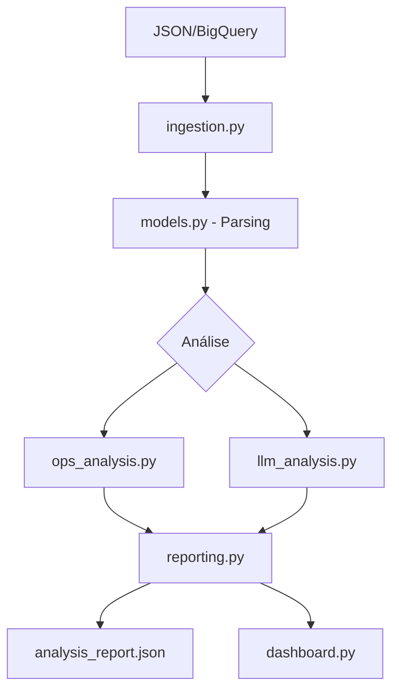

# Manual Técnico - Projeto Análise SDR

## Visão Geral da Arquitetura

```
┌─────────────────────────────────────────────────────────────────┐
│                         PIPELINE DE ANÁLISE                      │
├─────────────────────────────────────────────────────────────────┤
│                                                                  │
│  ┌──────────────┐    ┌──────────────┐    ┌──────────────┐       │
│  │   INGESTÃO   │───▶│   ANÁLISE    │───▶│  RELATÓRIO   │       │
│  │  ingestion   │    │  ops + llm   │    │  reporting   │       │
│  └──────────────┘    └──────────────┘    └──────────────┘       │
│         │                   │                   │                │
│         ▼                   ▼                   ▼                │
│  ┌──────────────┐    ┌──────────────┐    ┌──────────────┐       │
│  │    JSON      │    │   Métricas   │    │   Dashboard  │       │
│  │   BigQuery   │    │   TME/TMA    │    │   Streamlit  │       │
│  └──────────────┘    │   LLM Mock   │    └──────────────┘       │
│                      └──────────────┘                            │
└─────────────────────────────────────────────────────────────────┘
```

---

## Estrutura do Projeto

```
projeto_analise_SDR/
├── src/                          # Código fonte principal
│   ├── __init__.py               # Inicialização do módulo
│   ├── models.py                 # Modelos Pydantic (parsing de dados)
│   ├── ingestion.py              # Carregamento de dados JSON/BigQuery
│   ├── ops_analysis.py           # Análise operacional (TME, TMA)
│   ├── llm_analysis.py           # Análise qualitativa (LLM)
│   └── reporting.py              # Agregação e geração de relatórios
│
├── tests/                        # Testes unitários
│   ├── __init__.py
│   └── test_core.py              # Testes de models e ops_analysis
│
├── data/raw/                     # Dados brutos
│   └── exemplo.json              # Arquivo de exemplo para testes
│
├── docs/                         # Documentação
│   ├── TECHNICAL_MANUAL.md       # Este arquivo
│   └── USER_GUIDE.md             # Guia não-técnico
│
├── .github/workflows/            # CI/CD
│   └── ci.yml                    # GitHub Actions workflow
│
├── main.py                       # Script principal do pipeline
├── dashboard.py                  # Dashboard Streamlit
├── pyproject.toml                # Configuração do projeto (Poetry)
├── CONTRIBUTING.md               # Guia para contribuidores
└── README.md                     # Documentação inicial
```

---

## Componentes Principais

### 1. Models (`src/models.py`)

Define os modelos de dados usando **Pydantic** para validação e parsing.

#### Classes Principais:

| Classe | Descrição |
|--------|-----------|
| `Organization` | Organização do contato |
| `Contact` | Dados do cliente/contato |
| `Agent` | Dados do atendente |
| `MessageSender` | Quem enviou a mensagem |
| `Message` | Mensagem individual do chat |
| `ClosedInfo` | Informações de fechamento |
| `Chat` | Modelo principal com validadores |

#### Validadores Especiais:

```python
@field_validator('contact', mode='before')
def parse_contact(cls, v):
    """Parseia JSON stringificado para objeto."""
    if isinstance(v, str):
        return json.loads(v)
    return v
```

Os validadores lidam com campos que vêm como **strings JSON** no BigQuery.

---

### 2. Ingestão (`src/ingestion.py`)

Responsável por carregar dados de diferentes fontes.

```python
def load_chats_from_json(file_path: str) -> List[Chat]:
    """Carrega chats de um arquivo JSON."""
```

**Extensão futura**: Adicionar `load_chats_from_bigquery()`.

---

### 3. Análise Operacional (`src/ops_analysis.py`)

Calcula métricas quantitativas de atendimento.

#### Constantes:
```python
TZ = pytz.timezone('America/Sao_Paulo')
```

#### Funções Principais:

| Função | Descrição |
|--------|-----------|
| `is_business_hour(dt)` | Verifica se datetime está no expediente |
| `calculate_response_times(chat)` | Calcula TME e TMA |
| `analyze_agent_performance(chats)` | Ranking de agentes |

#### Horário Comercial:
- **Seg-Qui**: 08:00 - 18:00
- **Sex**: 08:00 - 17:00
- **Sáb-Dom**: Não considerado

#### Métricas:

| Métrica | Cálculo |
|---------|---------|
| **TME** (Tempo Médio de Espera) | Tempo entre mensagem do cliente e resposta do agente |
| **TMA** (Tempo Médio de Atendimento) | Duração total do chat (primeira à última mensagem) |

---

### 4. Análise Qualitativa (`src/llm_analysis.py`)

Análise usando LLM (Large Language Model) - **atualmente mockada**.

#### Prompts Definidos:
- `PROMPT_CX`: Análise de experiência do cliente
- `PROMPT_PRODUCT`: Inteligência de produto
- `PROMPT_SALES`: Análise de conversão

#### Retorno Mock:
```python
{
    "cx": {
        "sentiment": "neutral",
        "humanization_score": 4,
        "resolution_status": "resolved"
    },
    "product": {
        "products_mentioned": ["Ultrassom Microfocado"],
        "interest_level": "high"
    },
    "sales": {
        "outcome": "in_progress",
        "rejection_reason": None
    }
}
```

**Para integrar LLM real**: Descomentar código em `_call_llm()` e configurar API key.

---

### 5. Relatórios (`src/reporting.py`)

Agrega resultados e gera relatório final.

#### Estrutura do Relatório:
```python
{
    "agent_ranking": [...],      # Lista ordenada por TME
    "product_cloud": [...],      # Produtos mais mencionados
    "sales_funnel": {...},       # Contagem por status
    "loss_reasons": {...}        # Motivos de perda
}
```

---

## Fluxo de Dados



---

## Executando o Projeto

### Instalação
```bash
poetry install
```

### Pipeline Principal
```bash
poetry run python main.py
```

### Dashboard
```bash
poetry run streamlit run dashboard.py
```

### Testes
```bash
poetry run pytest --cov=src --cov-report=term-missing
```

---

## CI/CD

### Jobs do GitHub Actions:

| Job | Descrição |
|-----|-----------|
| `lint` | Ruff check e format |
| `typecheck` | Mypy |
| `test` | Pytest com coverage (Python 3.11, 3.12) |
| `security` | Bandit scan |

### Pre-commit Hooks:
- Ruff (lint/format)
- Mypy (type check)
- Trailing whitespace
- YAML validation

---

## Extensões Futuras

1. **Integração BigQuery**: Substituir JSON por query direta
2. **LLM Real**: Configurar OpenAI/Gemini API
3. **Banco de Dados**: Persistir resultados em PostgreSQL
4. **API REST**: Expor análises via FastAPI
5. **Agendamento**: Cron job para análises periódicas

---

## Troubleshooting

### Erro de Timezone
```python
# Garantir datetime aware
if dt.tzinfo is None:
    dt = pytz.utc.localize(dt)
```

### Erro de Parsing JSON
```python
# Campos podem vir como string
if isinstance(v, str):
    return json.loads(v)
```

### Cobertura Abaixo de 70%
```bash
# Ver linhas não cobertas
poetry run pytest --cov=src --cov-report=term-missing
```
