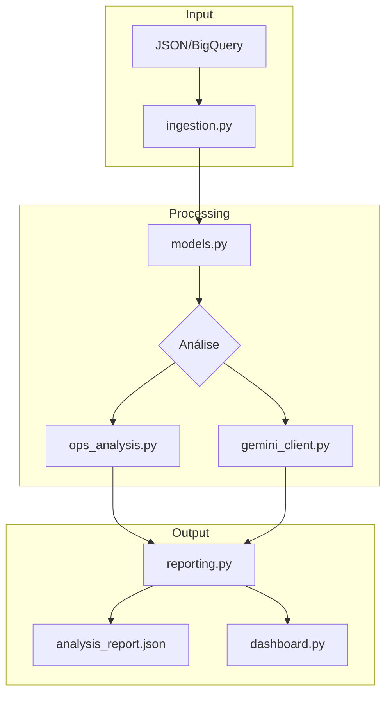

# Arquitetura do Sistema

## Visão Geral



---

## Fluxo de Dados

1. **Ingestão**: Dados são carregados de JSON ou BigQuery
2. **Parsing**: Modelos Pydantic validam e estruturam os dados
3. **Análise Operacional**: Cálculos de TME, TMA, ranking
4. **Análise Qualitativa**: Gemini API processa sentimento e produtos
5. **Relatório**: Dados agregados para visualização
6. **Dashboard**: Interface visual com Streamlit

---

## Componentes Principais

| Componente | Arquivo | Responsabilidade |
|------------|---------|------------------|
| Modelos | `src/models.py` | Estrutura de dados (Pydantic) |
| Schemas LLM | `src/llm_schemas.py` | Validação de output LLM |
| Ingestão | `src/ingestion.py` | Carregamento de dados |
| Análise Ops | `src/ops_analysis.py` | Métricas quantitativas |
| Gemini Client | `src/gemini_client.py` | Integração Gemini API |
| Context Provider | `src/context_provider.py` | Interface para contexto empresarial |
| Batch Analyzer | `src/batch_analyzer.py` | ETL com checkpoint |
| Relatórios | `src/reporting.py` | Agregação de resultados |
| Dashboard | `dashboard.py` | Interface visual |
| Pipeline | `main.py` | Orquestração |

---

## Stack Tecnológica

| Categoria | Tecnologia |
|-----------|------------|
| Linguagem | Python 3.12 |
| Gerenciador | Poetry |
| Validação | Pydantic |
| Timezone | pytz |
| Dashboard | Streamlit |
| Gráficos | Plotly |
| Testes | pytest + pytest-cov |
| Lint | Ruff |
| Types | Mypy |
| Docs | MkDocs Material |

---

## Estrutura de Diretórios

```
projeto_analise_SDR/
├── src/                    # Código fonte
├── tests/                  # Testes unitários
├── data/raw/               # Dados brutos
├── docs/                   # Documentação (MkDocs)
├── .github/workflows/      # CI/CD
├── main.py                 # Entry point
├── dashboard.py            # Interface visual
├── mkdocs.yml              # Config da documentação
└── pyproject.toml          # Config do projeto
```
