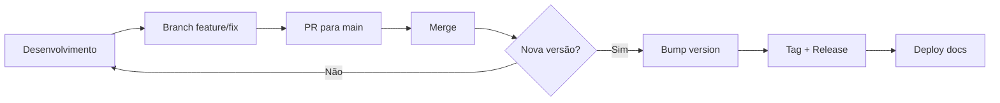

# Versionamento e Releases

Este documento descreve como gerenciar versões do projeto.

---

## 📋 Padrão de Versionamento

Usamos **Semantic Versioning (SemVer)**: `MAJOR.MINOR.PATCH`

| Parte | Quando incrementar | Exemplo |
|-------|-------------------|---------|
| **MAJOR** | Mudanças incompatíveis | Reestruturação total do dashboard |
| **MINOR** | Novas funcionalidades | Nova página, novo KPI |
| **PATCH** | Correções de bugs | Fix em gráfico, ajuste de filtro |

---

## 🏷️ Criando uma Release

### 1. Atualizar versão no pyproject.toml

```toml
[tool.poetry]
version = "0.3.0"  # Atualize aqui
```

### 2. Criar tag e release via Git

```bash
# Criar branch de release
git checkout -b release/v0.3.0

# Atualizar pyproject.toml com nova versão
# Commit das alterações
git add pyproject.toml
git commit -m "chore: bump version to 0.3.0"

# Voltar para main e fazer merge
git checkout main
git merge release/v0.3.0

# Criar tag
git tag -a v0.3.0 -m "Release v0.3.0 - Dashboard Multi-Página"

# Push com tags
git push origin main --tags
```

### 3. Criar Release no GitHub

1. Acesse: **GitHub → Releases → Draft a new release**
2. Selecione a tag criada (ex: `v0.3.0`)
3. Título: `v0.3.0 - Dashboard Multi-Página`
4. Descrição: Liste as principais mudanças
5. Clique em **Publish release**

---

## 📝 CHANGELOG

Mantenha um arquivo `CHANGELOG.md` na raiz do projeto:

```markdown
# Changelog

## [0.3.0] - 2025-12-12
### Adicionado
- Dashboard multi-página (Visão Geral, Agentes, Temporal, Leads)
- Filtros globais por agente e origem
- Modo lightweight para carregamento otimizado

### Corrigido
- Classificação de tags para BigQuery e mock data
- Gráficos vazios na página de Leads

## [0.2.0] - 2025-XX-XX
### Adicionado
- Anonimização de PII
- Otimização com pandas e asyncio
```

---

## 🔍 Verificando a Versão Atual

```bash
# Via Poetry
poetry version

# No código Python
from importlib.metadata import version
print(version("projeto-analise-sdr"))
```

---

## ❓ Preciso de Packages/PyPI?

**Não para este projeto.** 

| Cenário | Recomendação |
|---------|--------------|
| Dashboard interno | ✅ Tags + Releases |
| Biblioteca reutilizável | PyPI |
| Deploy em produção | Docker + tags |

O projeto é um **dashboard Streamlit** que roda localmente ou em servidor. Não precisa ser distribuído como package Python.

---

## 🚀 Workflow Completo


