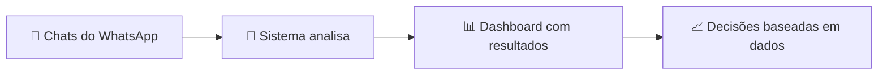

# Visão Geral do Sistema

## O que este sistema faz?

O **Sistema de Análise SDR** é uma ferramenta que lê automaticamente conversas de atendimento (chats) e extrai informações úteis para a equipe de vendas e gestão.

---

## Para quem é este sistema?

| Perfil | Como usar |
|--------|-----------|
| **Gestor de Vendas** | Acompanhar performance da equipe |
| **Coordenador de Atendimento** | Identificar gargalos e treinamentos |
| **Diretoria** | Relatórios executivos de conversão |
| **Marketing** | Entender produtos mais procurados |

---

## O que você pode descobrir?

### 🏆 Performance dos Atendentes
- Quem responde mais rápido?
- Quem converte mais?
- Qual o nível de "humanização" de cada um?

### 🔥 Produtos "Top of Mind"
- O que os clientes mais perguntam?
- Quais tendências estão surgindo?
- Que produtos estão em alta?

### 📊 Resultados de Vendas
- Quantos chats viram vendas?
- Por que perdemos vendas?
- Qual o tempo médio até fechar?

### 😊 Qualidade do Atendimento
- Os clientes estão satisfeitos?
- O atendimento é personalizado?
- Os problemas são resolvidos?

---

## Como funciona? (Explicação Simples)

1. **Chats são exportados** do sistema de atendimento
2. **O sistema lê** cada conversa automaticamente
3. **Métricas são calculadas** (tempo de resposta, conversão, etc.)
4. **Um dashboard** mostra os resultados de forma visual
5. **Você toma decisões** baseadas em dados reais

---

## Próximos Passos

- [Conhecer o Dashboard](dashboard.md)
- [Entender as Métricas](metrics.md)
- [Perguntas Frequentes](faq.md)
